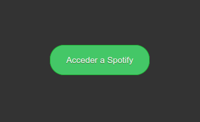
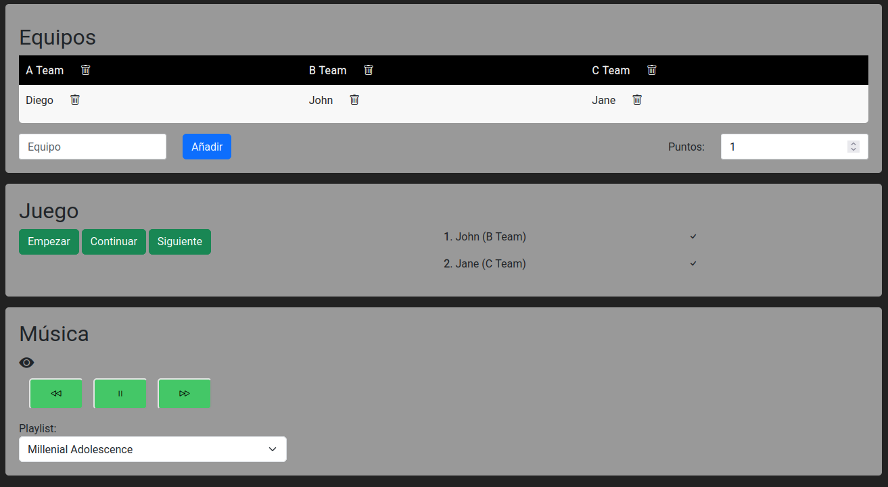
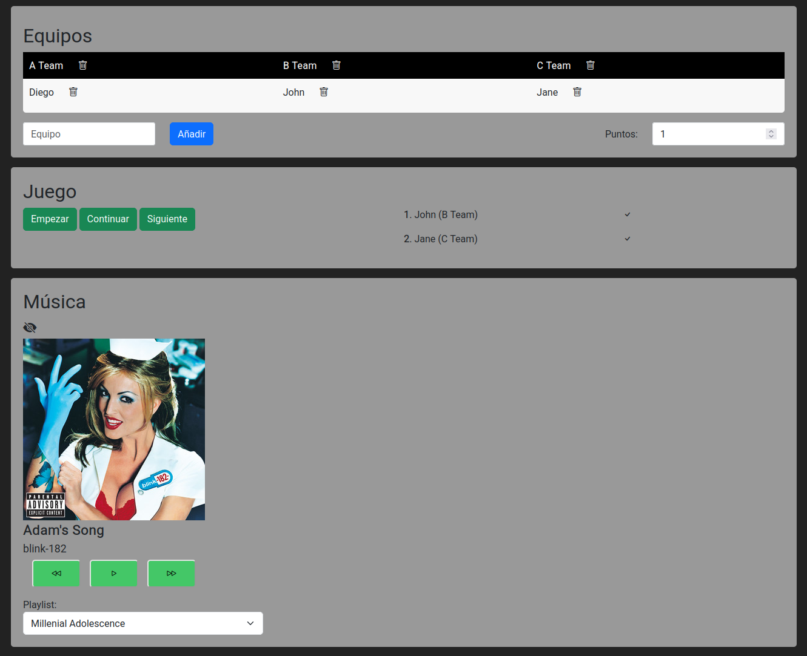
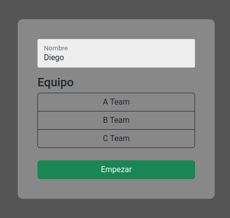
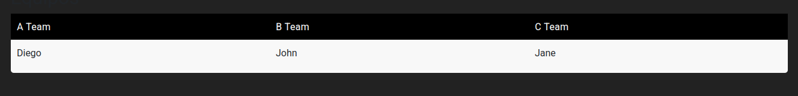
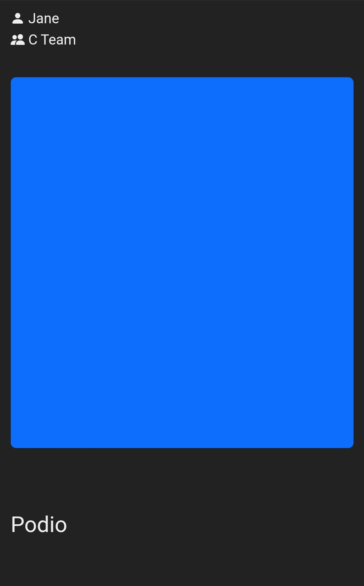
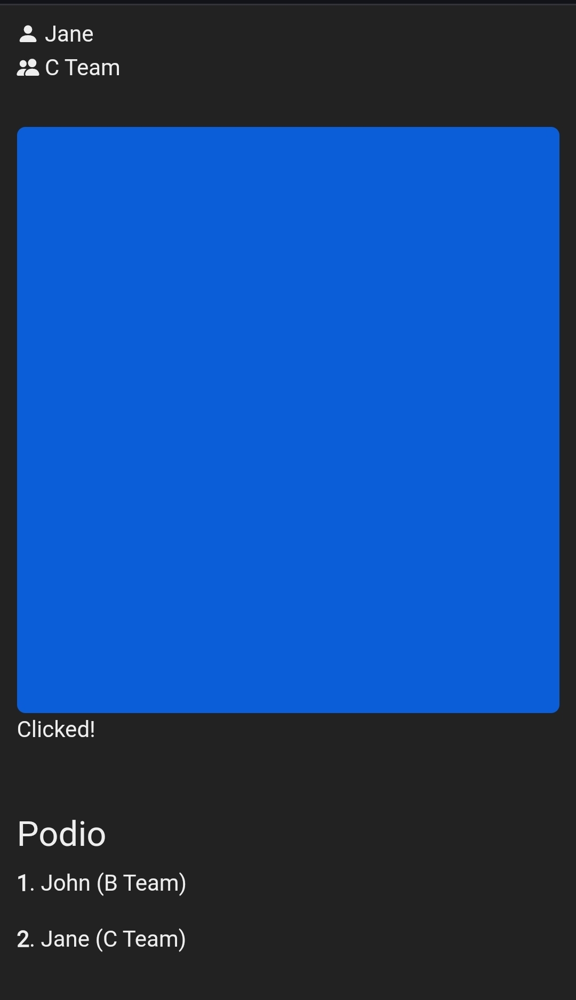
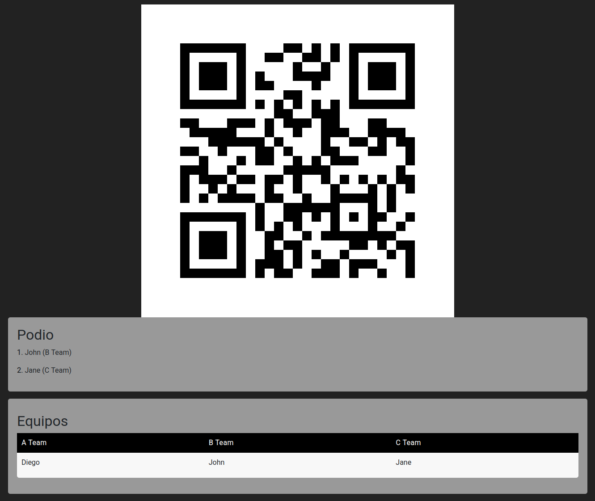

# Presto
A speed contest to guess the song (using Spotify playlists)

## Implementation details
The game uses the Spotify API to control the music.  
It uses websockets for part of the communication between the users and the server (when a user has clicked the button, when a new game has started...).  

## Endpoints
### Host
- `/host/spotifyLogin`  

- `/host/dashboard`  
  

### Player
- `/player/login`  

- `/player/waitingRoom`  

- `/player/button`  
  

### Kiosk
- `/kiosk`  

